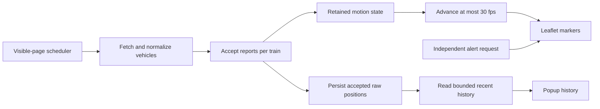

# Train motion: near-live prediction and recovery

Last reviewed: 2026-09-10. Decision: [ADR 12](decisions/12-continuous-prediction-and-runtime-budget.md).

## What the map promises

The marker is a **bounded estimate**, not a continuous GPS measurement. Renfe is
polled every 20 seconds while the page is visible; each train may report less often.
The model keeps motion continuous across ordinary position updates, predicts briefly,
then brakes and holds when it runs out of positional evidence. It does not deliberately
delay the map by a playback buffer, and it does not follow rail geometry.

- A normal update changes the target, not the current displayed coordinate.
- A repeated moving coordinate is a heartbeat, not proof that the train stopped.
- A faded/dashed marker means stale positional evidence, not a confirmed station stop.
- A reported stop, implausible jump or recovery baseline may reposition immediately.

## Why the old model looked stalled or too fast

### Compressed travel and reset discontinuities

The previous function interpolated the entire previous-to-current displacement over
two seconds, then extrapolated for at most nine seconds. At a 20-second polling cadence,
that produced a rush followed by at least nine seconds of holding. The next cycle started
from the previous raw report instead of the last displayed prediction.

A deterministic 300 km/h LD example reproduced:

| Event | Previous behavior |
| --- | --- |
| Travel between reports | 1.667 km over 20 seconds |
| First two animation seconds | Replayed 1.667 km: approximately 3,000 km/h visually |
| Elapsed 11–20 seconds | No further prediction movement |
| Next report boundary | Reset backward by approximately 750 m |

The former 6 km/h minimum also invented northward movement when two coordinates
were identical. Increasing CPU power or raising speed caps would not correct these rules.

### New timestamps do not necessarily mean new coordinates

Consider a train with the following reports along a straight route:

| Report time | Position | Interpretation |
| --- | --- | --- |
| 0 s | 0 km | Baseline |
| 20 s | 1 km | New fix: 180 km/h average |
| 40 s | 1 km | Same GPS position, still `IN_TRANSIT_TO`: heartbeat |
| 60 s | 3 km | New fix: 2 km since the 20-second fix, over 40 seconds |

Replacing the baseline at 40 seconds first implied zero velocity, then 360 km/h at
60 seconds (capped to 350 for LD). Retaining the **distinct fix at 20 seconds** gives
the correct interval average of 180 km/h. This does not recover the unknown instantaneous
speed; it avoids manufacturing a shorter sampling interval.

## Pipeline and source files

| Responsibility | Implementation |
| --- | --- |
| Polling, visibility and serialization | [scheduler](../src/core/scheduler.js) |
| JSON timeout and fallback | [HTTP helper](../src/data/http.js) |
| Receipt time and feed metrics | [feed service](../src/data/feedService.js) |
| Per-train acceptance and integration | [TrainMotion](../src/core/motion.js) |
| Distance, bearing and history speed helpers | [interpolation utilities](../src/core/interpolation.js) |
| Orchestration, filters, history and UI cadence | [application](../src/app.js) |
| Marker updates, icons and popup cadence | [map manager](../src/map/mapManager.js) |
| Native IndexedDB queries | [local store](../src/storage/db.js) |

## Retained state: fix time is not receipt time

Each train has one entry in `TrainMotion.tracks`, plus a reusable display object:

| Field | Meaning |
| --- | --- |
| `report` | Accepted raw position and source timestamp, with latest accepted metadata |
| `timestamp` | Time of the position baseline; repeated moving coordinates do not replace it |
| `latestTimestamp` | Latest comparable report time seen, including moving heartbeats; ordering watermark |
| `timestampKind` | `vehicle`, `header` or `receipt`; only comparable clocks establish velocity |
| `receivedAt` | Monotonic arrival time of the accepted baseline |
| `sourceAgeMs` | Nonnegative wall-clock age of that baseline at acceptance |
| `targetVx`, `targetVy` | Velocity estimated at acceptance, in local east/north km/s |
| `vx`, `vy` | Current displayed velocity, adjusted gradually per frame |
| `display` | Reused marker data, position, speed, heading, phase and freshness |
| `needsBaseline` | Suspended until suitable positional evidence arrives |

Report time falls back from positive vehicle source time to positive feed-header time,
then snapshot receipt time. Non-finite times and times more than five seconds in the
future are rejected. A changed coordinate with a different clock kind starts a new
baseline rather than deriving speed from mixed clocks.

Fix age progresses using `performance.now()` after acceptance, so animation does not
depend on subsequent wall-clock adjustments. Snapshot receipt timestamps use `Date.now()`
**after fetching**, not before network latency.

### Acceptance rules

1. Validate finite coordinates and the selected timestamp. Coordinates are also bounded
   to Spain by the existing parser.
2. Reject non-advancing comparable report times against `latestTimestamp`, per train.
   A globally newer merged header cannot make an old individual report fresh.
3. If both prior and incoming states are moving (`IN_TRANSIT_TO` or `INCOMING_AT`)
   and latitude/longitude are **exactly equal**, keep the positional baseline, velocity,
   heading, receipt time and prediction horizon. Update metadata and the approach cap;
   advance the ordering watermark only for a comparable clock.
4. For a distinct coordinate, derive motion from the previous accepted fix and its time.
   A displacement of three metres or less does not establish velocity or a heading.
5. Accept an advancing `STOPPED_AT` report, including the same coordinate. Hold at its
   reported position. A stopped-to-moving transition at the same coordinate changes
   status but starts with zero measured velocity; do not invent departure motion.
6. Remove tracks absent from the incoming normalized snapshot.

Exact coordinate equality is intentional: the three-metre velocity threshold is **not**
a fuzzy deduplication radius. Small non-identical changes are still accepted fixes.

Repeated positions can update platform/line/status metadata without refreshing the
position. Their ordering watermark is separate: after a heartbeat at 40 seconds, a
changed coordinate timestamped 30 seconds is still rejected as late.

## Continuous prediction and correction

### Velocity estimation and limits

Position deltas are converted to local east/north distances using latitude-scaled
degrees. Speed plausibility uses great-circle distance. Heading is calculated from
the two accepted fixes, not recomputed every animation frame.

| Rule | Current value |
| --- | --- |
| Default polling cadence | 20 seconds |
| Estimated prediction cadence | Distinct-fix interval clamped to 20–30 seconds |
| LD target speed ceiling | 350 km/h |
| Conventional target speed ceiling | 250 km/h |
| `INCOMING_AT` target ceiling | 45 km/h |
| Correction timescale | 10 seconds |
| Velocity-vector acceleration limit | 2 m/s² |
| Correction target speed ceiling | Smaller of service/status cap and 115% of measured speed |
| Minimum braking interval | 10 seconds; extended for current speed |
| Stale threshold | Fix age ≥40 seconds, or an earlier prediction hold |
| Displacement reset threshold | Greater than 15 km |
| Implausible source-speed threshold | Greater than 1.5× the service cap |
| Old-history interval | Greater than 80 seconds |

There is no positive minimum speed. Service type comes from the source dataset, not
the calculated speed. Caps constrain the **target velocity**; an already faster display
decelerates at the acceleration limit when a lower approach cap arrives.

### Finite prediction horizon

Let `a` be accepted-fix age, `C` the cadence, and `B` the braking interval, all in seconds.
The braking fraction is:

$$
q = \operatorname{clamp}\left(\frac{a-C}{B}, 0, 1\right)
$$

The prediction target integrates constant motion then linear braking:

$$
T = \min(a,C) + B\left(q-\frac{q^2}{2}\right),\qquad
p_{target} = p_{fix} + v_{measured}T
$$

`B` is the greater of ten seconds and the time needed to brake the larger of
115% of measured speed or current displayed speed at 2 m/s². At 300 km/h that is
approximately 48 seconds: the finite horizon is about 68 seconds with a 20-second
cadence, not a universal ten-second stop. Stale styling starts at 40 seconds even if
braking is still in progress. Repeated coordinates do not restart this horizon.

### Per-frame integration

- Compute local position error relative to the prediction target; divide by ten seconds
  to produce a correction velocity.
- Prevent the correction alone from reversing along the measured direction. A genuine
  changed direction can arrive in a new report.
- Reduce desired velocity and its cap by the remaining braking fraction, then bound
  the velocity change by acceleration × frame duration.
- Integrate position using the average of old and new displayed velocities.
- At the end of the horizon, set velocity to zero and hold the displayed position.

Ordinary new reports keep the exact current display position and velocity. This is
the key difference from replaying the latest segment in two seconds. The correction
timescale is not a promise that every error disappears within ten seconds.

Frame duration is capped at 100 ms. Gaps above two seconds suspend all tracks instead
of replaying missed motion. First reports, clock changes, old history, implausible
jumps, station stops and resume baselines are explicit reset exceptions to continuity.

## Motion phases and user-visible meaning

| `motionModel` | Meaning |
| --- | --- |
| `predictive_continuous` | Following the estimated path while within cadence |
| `prediction_braking` | No new distinct fix within cadence; prediction slows |
| `stale_hold` | Prediction horizon exhausted; displayed velocity is zero |
| `reported_stop` | Latest accepted status confirms a stop; use reported coordinate |
| `awaiting_fresh_report` | Suspended after hidden/long-frame recovery; no replay |
| `position_reset` | Acceptance-time diagnostic for an implausible jump; a later frame may replace it |

Freshness is separate from motion phase: a reported station stop can also become old.
The faded/dashed style and five-language legend distinguish stale evidence from a stop.
Popup speed is displayed-motion speed; history speed is an average between stored raw
fixes, so the two values need not match. Raw history speeds are not service-capped.

## Background tabs, startup and network recovery

- Hidden tabs suspend motion and stop scheduled polling. An already-running request is
  not cancelled solely because the page became hidden; its applied state remains suspended.
- Returning visible requests one refresh. If another request is still active, queue at
  most one follow-up. Forced platform-setting refreshes share this same serialization.
- Normal scheduling uses the next strictly future 20-second boundary. There is only one
  owned timer; stop/visibility transitions clear it.
- Recent local history (<40 seconds by snapshot receipt) may seed initial velocity, but
  the first usable live report supplies the display baseline. A moving heartbeat at the
  same coordinates does not clear suspension; a distinct fix or stop transition is needed.
- Vehicle and alert requests start concurrently, but vehicles no longer wait for alerts.
  An alert result only applies if it belongs to the latest applied tick.
- The shared JSON helper has a 15-second timeout per request. Retry delays remain
  0/2/4/8 seconds, and fallbacks can add more requests: this is not a 15-second total
  fetch-cycle deadline. The first attempt starts immediately.

## Runtime and storage budget decisions

Motion math was not shown to exhaust the tested desktop, but avoidable per-frame work
and growing history scans were present. The implementation keeps Leaflet and plain JS:

- Reuse per-train display objects and filtered vehicle membership; invalidate filters
  on feeds, settings or alerts rather than reconstructing everything per frame.
- Advance live motion at most 30fps, including while history is displayed; do not render
  live markers over playback. Playback still uses its existing player, not this predictor.
- Update stats in the animation loop at 1Hz (event-driven updates can also occur).
- Rebuild visible popup contents at 1Hz and immediately when opened, not every frame.
- Skip nearly unchanged marker positions (≤0.000001 degrees on both axes). Avoid most
  offscreen position writes; cache padded bounds and refresh on map movement. All train
  states still advance: this is not full offscreen simulation culling.
- Read history insights with `count()`, a first-key cursor, and at most 18 newest records
  from a reverse cursor. Return recent rows in ascending order.
- Prune via an exclusive upper-bound key-range delete; load playback with an inclusive
  key range. Full export intentionally still reads all snapshots.

The database stays `spaintrain-db`, version 1, with unchanged stores/indexes. No migration
or history deletion is needed. Stored vehicle positions are accepted raw fixes, not
display predictions. New snapshots can retain an older source timestamp for a repeated
moving coordinate. Duplicate/regressed source timestamps yield zero history speed.
The menu's discarded-snapshot count is not a per-train repeated-coordinate counter.

### Measurements, not guarantees

Short samples from the local development browser on 2026-09-10:

| Sample | Markers | Mean motion/render call | p95 |
| --- | ---: | ---: | ---: |
| Before, popup closed | 489 | 3.67 ms | 4.7 ms |
| After, popup closed | 481 | 1.45 ms | 2.2 ms |
| Before, popup open | 383 | 9.66 ms | 10.9 ms |
| After, popup open | 472 | 2.93 ms | 4.8 ms |

The final popup sample rebuilt content five times in six seconds. These samples differ
in train count, feed state and browser scheduling; they are not a controlled benchmark,
full-frame cost, mobile guarantee, or proof that every long-session pause is eliminated.

## Regression coverage and reproduction

Run `npm run test:run`, then `npm run build`, then `npm run test:e2e` from the repository
root (not the separate FastEnough starter). At this revision: **71 unit tests and 10
browser tests passed**, with a successful production build.

| Suite | Important guarantees tested |
| --- | --- |
| [Motion](../src/core/motion.test.js) | No two-second burst or eleven-second pause; ordinary boundary continuity; acceleration; stale hold; moving-coordinate heartbeats; full-gap speed; stop/departure; resume; clock changes; future/late reports |
| [Scheduler](../src/core/scheduler.test.js) | Single flight/timer, coalesced forced refresh, hidden/resume, stop, exact-boundary scheduling |
| [Storage](../src/storage/db.test.js) | v1 schema, inclusive ranges, bounded recent cursors, exclusive prune, clear/settings APIs |
| [Math/history speed](../src/core/interpolation.test.js) | Distance/bearing utilities and source-time ordering/fallback |
| [Browser motion](../tests/e2e/motion-regression.spec.js) | New timestamps with repeated GPS become stale, hidden/resume, slow alerts, real IndexedDB startup with 1,000 snapshots ×100 vehicles and no unbounded history read |
| [Existing UI](../tests/e2e/main-regression.spec.js) | Dataset icons, telemetry, legend, alerts, filters, theme and language |

Unit storage tests use the development-only `fake-indexeddb` dependency; browser tests
exercise native IndexedDB. Routed feed tests block service workers to prevent reloads
from bypassing fixtures. Clock-driven tests wait for initial persistence before advancing
time; visible motion uses incremental time, hidden periods use fast-forward.

For manual inspection: follow a moving LD train through several polls, open its popup,
then hide and restore the tab. Check that a normal fix does not reset backward, unchanged
GPS eventually becomes stale, and a confirmed stop retains its orange horizontal icon.
Use deterministic fixtures for duplicates rather than assuming the live feed will repeat.

## Limits and follow-ups

- Straight-line prediction can cut corners or leave the tracks. Map matching is separate work.
- GPS jitter, changing service metadata, missing timestamps and source-status quality
  can still affect estimates. Exact deduplication does not suppress near-identical noise.
- Real stops reset immediately; preserving acceleration through a station stop is not promised.
- A missing train is removed from a full snapshot; a partial upstream outage can therefore
  remove that source's trains. Per-source membership continuity is not implemented here.
- Historical records written before these changes are not repaired. Playback remains
  snapshot-based and retains existing compact-storage metadata limitations.
- Broader service-worker fallback behavior and optional Overpass overlay timeouts remain
  outside this change. Existing dependency security advisories were not remediated.
- Longer device-specific profiling is needed before considering workers, Canvas/WebGL,
  adaptive rendering cadence or a different map engine.